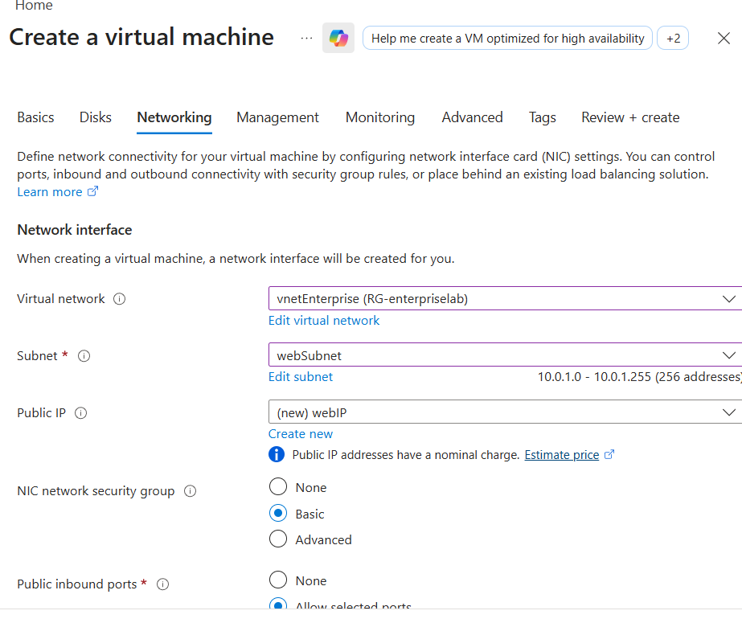
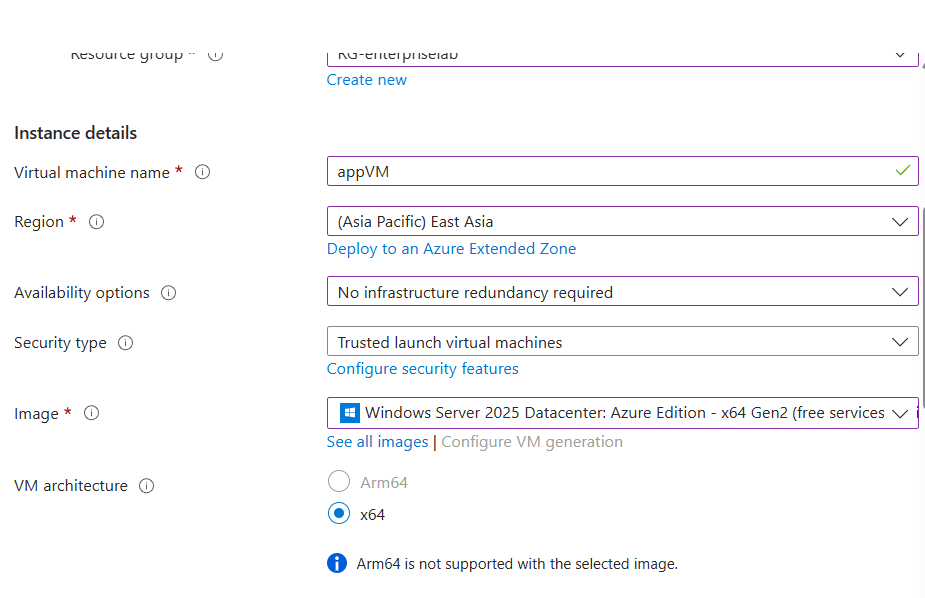
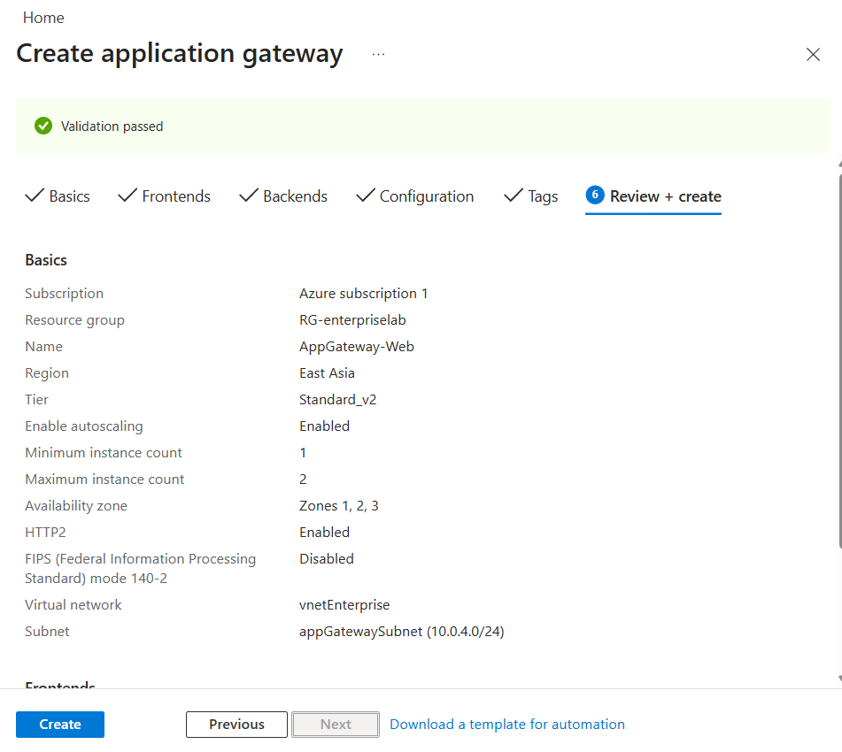
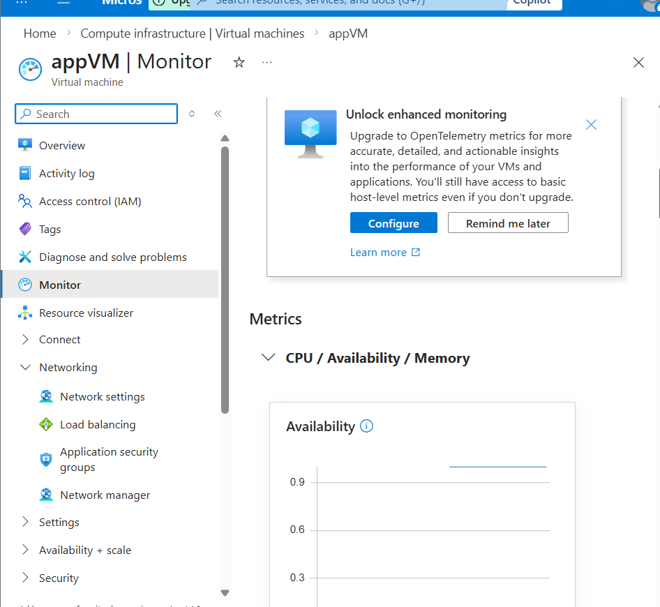
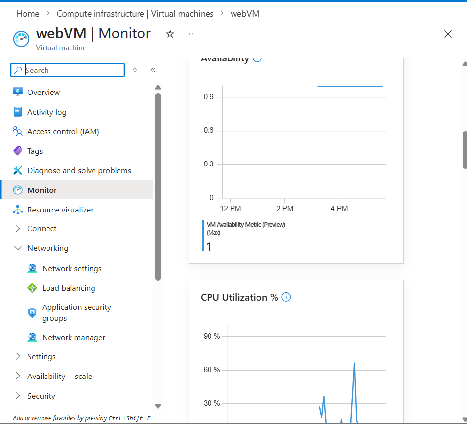
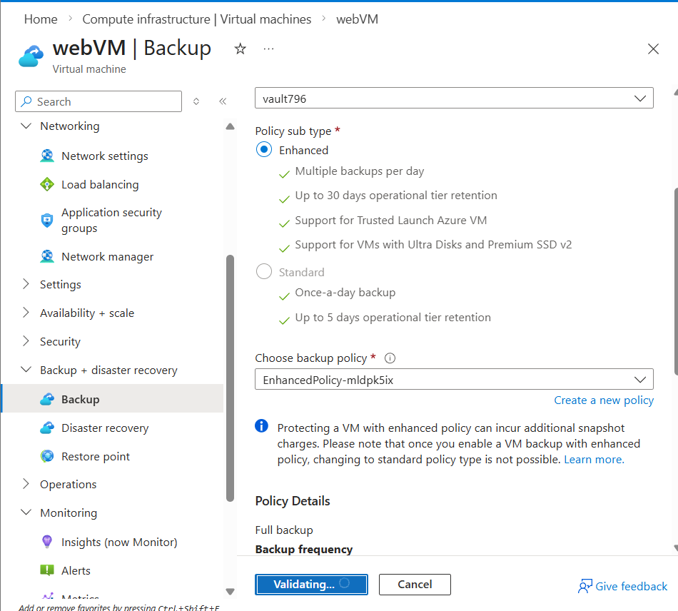
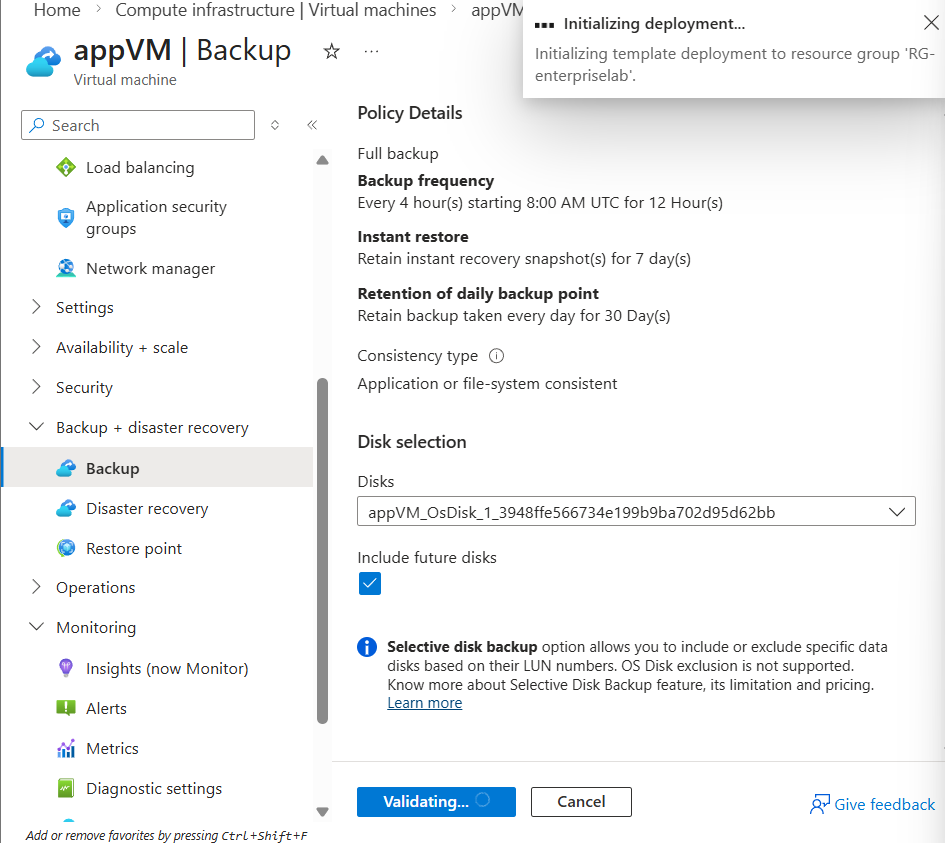
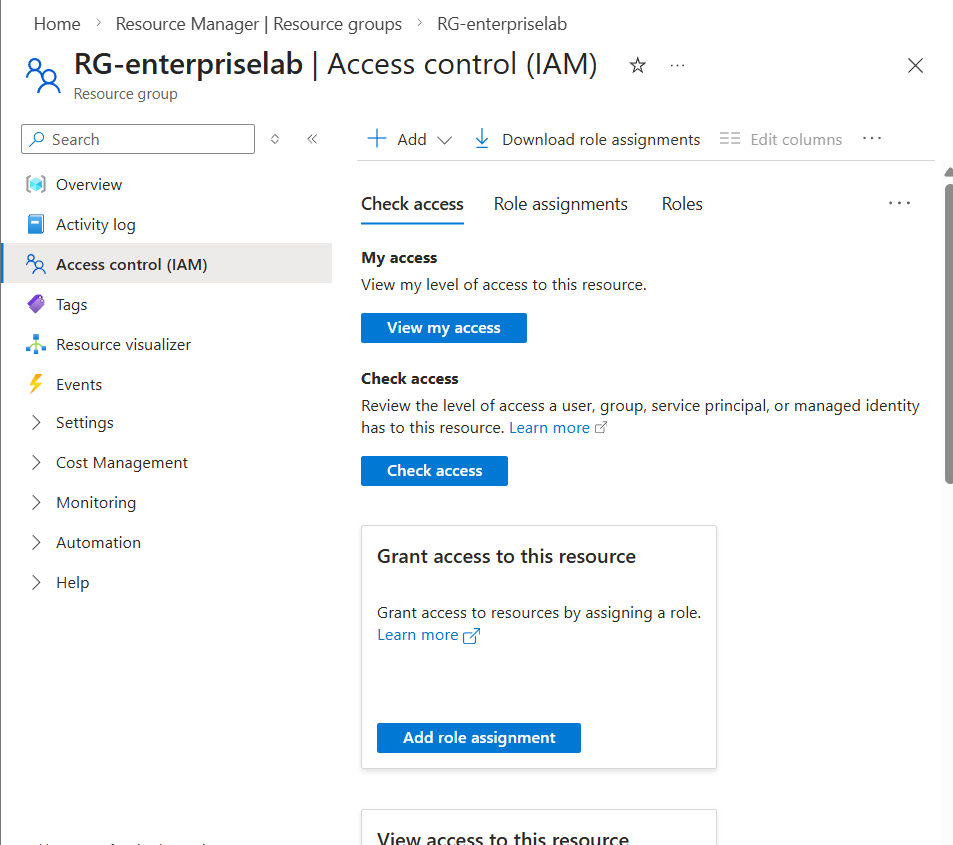

# Cloud Infrastructure Project

## Overview
This project demonstrates a complete cloud infrastructure setup using Microsoft Azure. It includes VMs, networking, monitoring, backup, and RBAC implementation. The project also includes an ARM template for redeployment.

## Key Steps Completed

1. **Virtual Machines**
   - Created **Web VM** and **App VM**.
   - Configured OS, networking, and security.

2. **Networking**
   - Deployed **Application Gateway** for traffic routing.
   - Configured **NSG rules** and public IP.

3. **Monitoring**
   - Enabled **VM Insights** for both VMs.
   - Configured **Application Gateway diagnostics** to send logs to Log Analytics Workspace.

4. **Backup**
   - Configured **Recovery Services Vault** for VM backups.

5. **RBAC (Role-Based Access Control)**
   - Demonstrated **Reader role** assignment.
   - Ready to assign HR and employee accounts once available.

6. **ARM Template**
   - Exported full ARM template (`CloudInfrastructureProject.json`) for redeployment

## Screenshots
- 
- 
- 
- 
- 
- 
- 
- 

